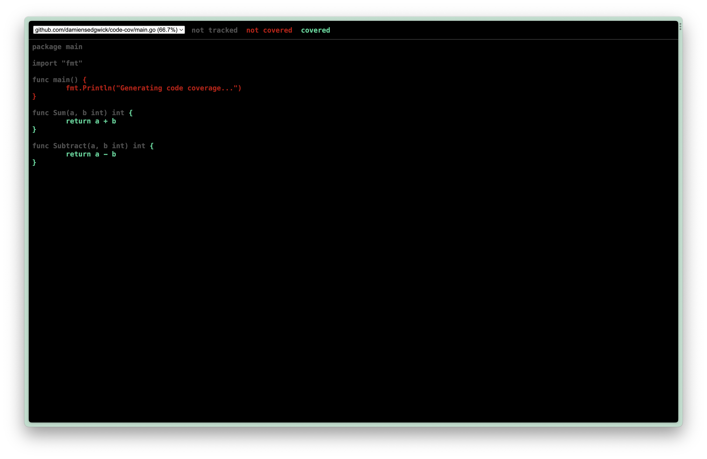

# Go Code Cove

A very quick and dirty demonstration of how to use code coverage when testing
with Go.

## Getting started

Clone this repository down into your preferred working directory:

`gh repo clone damiensedgwick/go-code-cove`

Run the following command to run the tests and create a `cover.out` file

`go test -coverprofile cover.out`

Lastly, run this command to open `cover.out` in your default browser

`go tool cover -html=cover.out`

## What to expect

After you have cloned the repository and ran the first test command, you should
see the following output in your terminal:

```go
go test -coverprofile cover.out
PASS
coverage: 66.7% of statements
ok  	github.com/damiensedgwick/code-cov	0.266s
```

Then when you run the second command to open the report in your browser, you
should see the following:



(Unsure why my browser is jet black, this could be a bug with the report)
